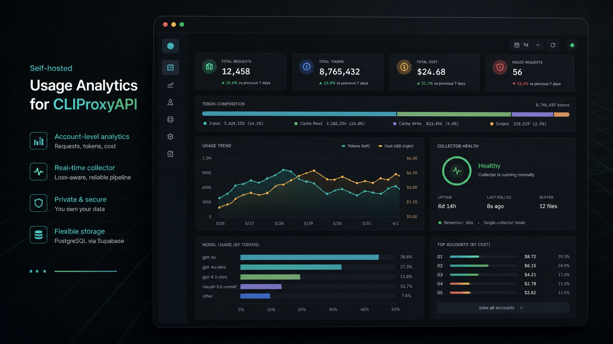
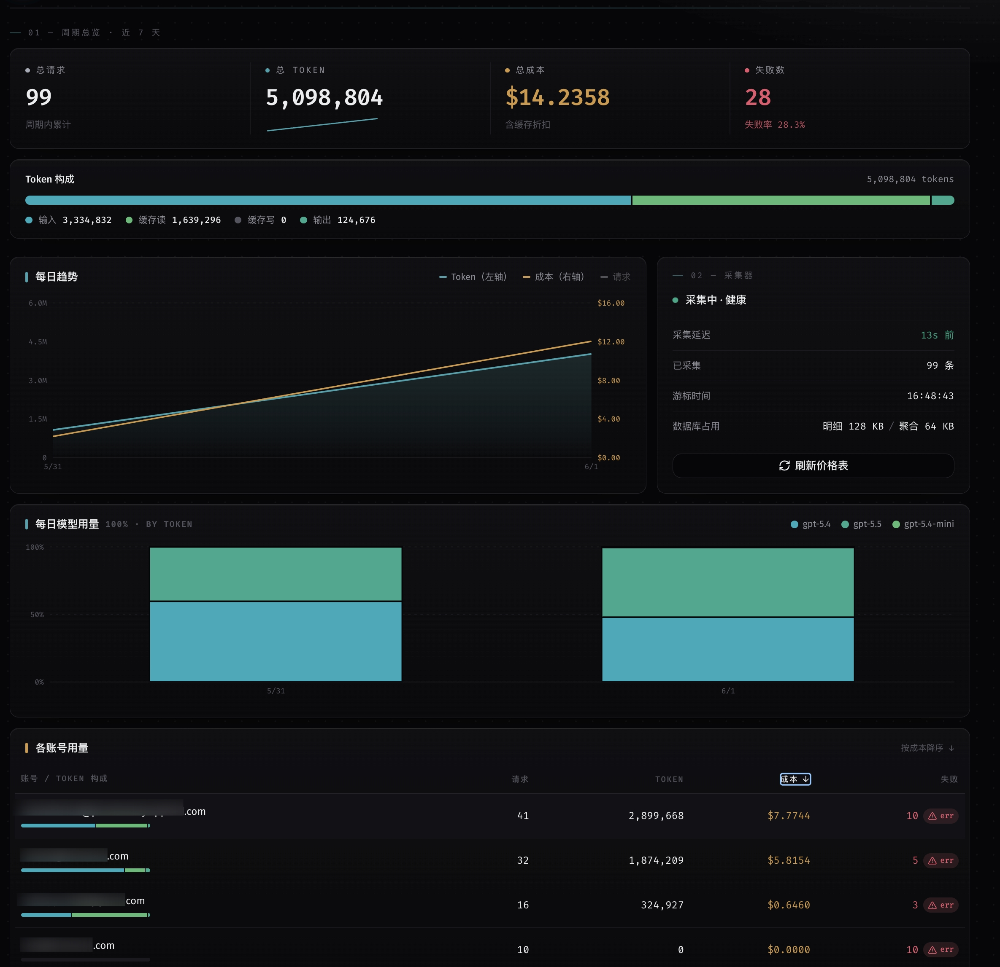

# CPA Usage Lens

[](https://github.com/yyykf/cpa-usage-lens/releases)
[](https://github.com/yyykf/cpa-usage-lens/actions/workflows/ci.yml)
[](./LICENSE)

[](https://go.dev)
[](https://react.dev)
[](https://www.typescriptlang.org)
[](https://vite.dev)
[](https://tailwindcss.com)
[](https://supabase.com)
[](https://www.docker.com)

[English](./README.md) · **简体中文**

为运行 CLIProxyAPI (CPA) 的小服务器用户，提供**不占用本地资源**的账号级用量分析：用外部采集器消费 CPA 用量队列，把精简数据写入 **Supabase 云数据库**，并提供一个**美观的暗色 Web 仪表盘**，随时查看每个账号在一段周期内的请求数、token 用量与估算成本。

> **差异化**：数据上 Supabase 云、本地近乎零负担（现有同类项目多用本地 SQLite）。



> 概念预览：这张生成图展示的是后续视觉方向，不代表当前界面已完全实现；下方真实打码截图才是当前产品实际效果。

## 产品预览



## 特性

- 📊 **暗色 Bento 仪表盘**：周期总览 · 各账号用量榜 · 各 API key 用量榜（脱敏）· 每日趋势 · 采集器健康
- ☁️ **云端存储**：数据在 Supabase 云，本地只跑两个轻量容器（backend + frontend）
- 💰 **query-time 成本估算**（LiteLLM 价格表）：只存用过的模型，缺价标"未知"，改价自动生效（无需回填）
- 🔒 **单用户密码登录**（bcrypt + JWT），所有数据 API 鉴权
- 🛡️ **防丢数据**：落盘缓冲（已 pop 未写库先落盘，确认写入后才删，重启自动恢复）
- ♻️ **容量有界**：热明细短期保留（默认 7 天，可配）+ 日聚合长期；先聚合后清理，绝不误删
- 🔑 **写库前剥离敏感字段**：`api_key` **明文绝不入库**（仅留不可逆指纹 `sha256` + 掩码 `sk-…后4位` 用于按 key 看用量）；`response_headers` / `fail.body` 完全不入库

## 架构

```
CPA  GET /usage-queue  --轮询 pop-->  采集器（剥敏感 / (request_id, event_ts, total_tokens) 复合键去重 / 落盘缓冲）
                                         │
                                         ▼
        request_events_hot（热明细，留 N 天）--每 rollup--> daily_account_usage（账号+模型+天，长期）
                                                                      │
   backend(Go 单进程) = 采集循环 + rollup/清理 + 价格刷新 + HTTP API + 鉴权
   frontend(React)  = nginx 静态托管 + 反代 /api
   数据库 = Supabase 云（不进 compose）
```

## 快速开始

详见 **[docs/deployment.md](docs/deployment.md)**。三步：

1. **Supabase 建表**（`supabase db push` 或 SQL Editor 跑 `supabase/migrations/`）
2. **复制 `.env.example` 为 `.env`** 并填写（CPA 地址/key、Supabase 连接串、登录密码）
3. **使用最新发布 tag** 启动预构建镜像 → 浏览器访问 `http://<服务器>:8088`

```bash
export CUL_VERSION=<latest-release-tag>
docker compose -f docker-compose.prod.yml up -d
```

请从 [GitHub Releases](https://github.com/yyykf/cpa-usage-lens/releases) 复制最新 tag。无需 clone 源码的部署路径、以及需要直连 backend 时的调试 override，见[部署文档](docs/deployment.md)。

> ⚠️ CPA 侧需 `usage-statistics-enabled: true`，且同一 CPA 队列**只能跑一个**采集器。详见 [重要约束](#重要约束)。

## 技术栈

| 层 | 技术 |
|----|------|
| **后端** | Go（`pgx` 直连 Supabase Postgres、标准库 `net/http`、`bcrypt`、`golang-jwt`） |
| **前端** | React 18 + Vite + TypeScript + Tailwind CSS + Recharts + lucide-react |
| **数据库** | Supabase（Postgres） |
| **部署** | Docker Compose（backend + frontend 两容器） |

## 项目结构

```
backend/    Go 后端：cmd/server + internal/{config,db,model,collector,rollup,pricing,api,timeutil}
frontend/   React 前端：src/{components,pages,lib}
supabase/   migrations（建表 SQL）
docs/       部署与运维文档
```

## 重要约束

> 部署前务必阅读 —— 关乎数据完整性。

- **全局单采集器**：同一个 CPA 队列**只能跑一个**本工具实例。队列是 pop（取走即删）语义，多实例会互相抢走对方的数据。
- **pop 不可回放**：采集器停机**超过 `redis-usage-queue-retention-seconds`**（默认 60s，建议 3600s）期间产生的请求，会**永久丢失** —— CPA 队列纯内存、不落盘，过期即清。
- **CPA 必须启用队列**：设 `usage-statistics-enabled: true`（官方注释把它写成"内存聚合开关"是过期的，实际是队列总闸，必须 true）。

完整运维细节 —— 只读实例开关（`COLLECTOR_ENABLED`）、容量假设、停机恢复 —— 见 **[docs/deployment.md](docs/deployment.md)**。

## 许可证

[MIT](./LICENSE) © 2026 KaiFan Yu
